# Rentil — dokumentacja techniczna frontendu

| Metadane | Wartość |
| --- | --- |
| Stan projektu | funkcjonalne MVP połączone z API |
| Wersja aplikacji | `1.0.0` |
| Zakres | katalog `frontend/` |
| Ostatnia aktualizacja | 28 lipca 2026 |
| Źródło prawdy | bieżący kod, `package.json` i [`backend/Docs/ENDPOINTY.md`](../../backend/Docs/ENDPOINTY.md) |

## 1. Najważniejsze adresy

- Aplikacja deweloperska: **[https://rentil-dev.calantris.com/](https://rentil-dev.calantris.com/)**
- Domyślne API: `https://api-rentil.calantris.com`
- Lokalne uruchomienie web: zwykle `http://localhost:8081`

### Konta testowe

| Rola | E-mail | Hasło |
| --- | --- | --- |
| Użytkownik | `syzyf_test@test.pl` | `@Test356!` |
| Administrator | `pankracy_test@test.pl` | `@Test357!` |

Konta i hasła służą wyłącznie do testów. Nie wolno używać ich w środowisku produkcyjnym.

## 2. Zakres funkcjonalny

Rentil jest aplikacją Expo/React Native do przeglądania i wypożyczania sprzętu. Wspólny kod działa w przeglądarce, na Androidzie i iOS.

### Dostęp bez logowania

- przeglądanie strony głównej, kategorii, katalogu i promocji;
- wyszukiwanie produktów po wpisaniu co najmniej 2 znaków;
- filtrowanie katalogu według kategorii, ceny i promocji;
- sortowanie załadowanej strony wyników po cenie rosnąco lub malejąco;
- przeglądanie szczegółów, galerii, specyfikacji i recenzji produktu;
- rejestracja, potwierdzenie konta kodem, logowanie i reset hasła;
- przejście do logowania przy próbie dodania produktu do ulubionych albo wypożyczenia.

### Zalogowany użytkownik

| Obszar | Dostępne operacje |
| --- | --- |
| Strona główna | Wylosowanie jednej dziennej promocji, podgląd czasu do kolejnego losowania i przejście do promowanego produktu. |
| Ulubione | Dodanie i usunięcie produktu oraz wyświetlenie własnej listy. |
| Wypożyczenie | Podanie dat `od` i `do` w formacie `RRRR-MM-DD` oraz złożenie wniosku. |
| Moje wypożyczenia | Podgląd terminu, statusu i ceny końcowej; zwrot wypożyczenia ze statusem `aktywny`. |
| Recenzje | Dodanie oceny `1–5` i opcjonalnego komentarza po zwrocie; podgląd własnych recenzji. |
| Konto | Podgląd profilu, edycja imienia i nazwiska, zmiana e-maila, przełączenie 2FA i usunięcie konta. |
| Sesja | Odtworzenie sesji po uruchomieniu aplikacji oraz wylogowanie. |

Cykl wypożyczenia:

```text
oczekujacy ──> zaakceptowany ──> aktywny ──> zwrocony
     └──────> odrzucony
```

Aktywacja oznacza wydanie sprzętu. Zwrot ponownie ustawia sprzęt jako dostępny.

### Administrator

Konto z rolą `admin` otrzymuje pozycję **Dashboard** oraz dodatkowe akcje:

| Moduł | Filtrowanie i podgląd | Operacje zmieniające dane |
| --- | --- | --- |
| Wnioski | ID użytkownika, ID sprzętu, status, data, paginacja i ekran szczegółów | Akceptacja, odrzucenie, aktywacja, zwrot, edycja częściowa `PATCH`, pełne nadpisanie `PUT` i wysyłanie przypomnień. |
| Użytkownicy | Imię, nazwisko, e-mail, rola, paginacja i szczegóły konta | Edycja danych, e-maila, opcjonalnego hasła i roli; usunięcie innego konta. Administrator nie zmienia własnej roli w tym formularzu. |
| Recenzje | ID użytkownika, ID sprzętu, status, liczba gwiazdek, paginacja i szczegóły | Ukrycie, ponowne opublikowanie oraz logiczne usunięcie. |
| Promocje | Nazwa, stan, typ, sprzęt, kategoria, użytkownik i promocje dzienne | Utworzenie, edycja, włączenie, wyłączenie i natychmiastowe wygaszenie promocji. |
| Produkty | Karty produktu, szczegóły, zdjęcia i specyfikacje | Dodanie, edycja ceny/opisu/statusu/specyfikacji, dodanie lub usunięcie zdjęć oraz usunięcie produktu dozwolonego przez API. |
| Kategorie | Lista kategorii i ich zdjęcia | Dodanie, edycja oraz usunięcie kategorii dozwolonej przez API. |
| Stan systemu | Odczyt endpointu głównego API | Prezentacja osobnych stanów `API`, `database` i `S3` jako `OK` albo `ERROR`. |

### Wiadomości e-mail

Backend wysyła wiadomości. Frontend udostępnia formularze kodów i przyciski uruchamiające poniższe operacje:

| Operacja | Kto i kiedy może ją wykonać | Efekt |
| --- | --- | --- |
| Potwierdzenie rejestracji | Osoba zakładająca konto | Kod trafia na podany e-mail; jest ważny 15 minut i ma limit 5 prób. Po potwierdzeniu można się zalogować. |
| Logowanie 2FA | Konto z włączonym 2FA | Po poprawnym haśle frontend otrzymuje `challenge`, wyświetla formularz sześciocyfrowego kodu i potwierdza logowanie. Kod jest ważny 10 minut i ma limit 5 prób. |
| Reset hasła | Użytkownik podaje adres e-mail | Kod jest ważny 15 minut i ma limit 5 prób. Formularz wymaga kodu, nowego hasła i jego powtórzenia; po zmianie backend wysyła powiadomienie. |
| Zmiana e-maila | Zalogowany użytkownik podaje nowy e-mail i aktualne hasło | Kod trafia na nowy adres, a informacja o zmianie na stary. Po potwierdzeniu aplikacja odświeża dane konta. |
| Włączenie/wyłączenie 2FA | Zalogowany użytkownik w ustawieniach konta | Frontend przełącza ustawienie, a backend wysyła informację o zmianie zabezpieczeń. |
| Przypomnienie o odbiorze | Administrator; wniosek ma status `zaakceptowany` | Backend wysyła miejsce i godziny odbioru. |
| Przypomnienie o zwrocie | Administrator; wypożyczenie ma status `aktywny` | Backend wysyła termin i miejsce zwrotu. |
| Informacja o opóźnieniu | Administrator; wypożyczenie jest aktywne i `data_do` jest wcześniejsza niż bieżący czas | Backend wysyła informację o przeterminowanym zwrocie i dane kontaktowe. |

Domyślne dane wiadomości są ustawiane w backendzie przez `MAIL_PICKUP_LOCATION`, `MAIL_PICKUP_HOURS`, `MAIL_RETURN_LOCATION` i `MAIL_CONTACT`.

### Elementy widoczne, ale niewykonujące operacji

- opcja „Zapamiętaj mnie” nie zapisuje osobnej preferencji;
- w mobilnym wariancie ekranu logowania napis „Nie pamiętasz hasła?” nie ma obecnie przypisanej nawigacji; reset działa przez trasę `/password_reset`.

## 3. Architektura i komponenty

```text
ekran Expo Router
      │
      ▼
src/features/<domena>
  screen + service + types
      │
      ▼
app/services/api.ts
      │  fetch + credentials: "include"
      ▼
REST API ──> baza danych / S3 / e-mail
```

- `app/` zawiera trasy i główny `AuthProvider`.
- `src/features/` grupuje ekrany, typy i serwisy według domen.
- `src/components/shared/` zawiera współdzielone elementy UI.
- `app/services/api.ts` udostępnia metody HTTP dla JSON i `FormData`.
- `AuthContext` odtwarza sesję przy starcie, obsługuje logowanie, 2FA i wylogowanie.
- Sesja backendu jest przesyłana w cookie `session_id`; każde żądanie używa `credentials: "include"`.
- Brak sesji zwraca zwykle `401`, brak wymaganej roli `403`, a konflikt stanu zasobu `409`.

### Komponenty współdzielone

| Komponent | Odpowiedzialność i zachowanie |
| --- | --- |
| `HeaderPanel` | Responsywny nagłówek. Ładuje kategorie, wyszukuje produkty po minimum 2 znakach z opóźnieniem 300 ms, pokazuje sugestie i prowadzi do katalogu, ulubionych, konta, logowania lub Dashboardu. |
| `PageLayout` | Wspólne tło, nagłówek i przewijany obszar strony. Obsługuje wariant `wide`, układ mobilny poniżej 760 px i przewinięcie do góry po zmianie klucza. |
| `ProductGrid` | Renderuje produkty przez `FlatList` albo statyczne wiersze, zmienia liczbę kolumn i przekazuje akcje ulubionych oraz administratora do kart. |
| `ProductCard` | Pokazuje zdjęcie, status, opis, aktualną cenę i średnią ocen. Otwiera szczegóły, przełącza ulubione, a w trybie administratora udostępnia edycję i warunkowe usunięcie. |
| `ProductReviewsSection` | Pokazuje średnią, liczbę opinii, gwiazdki, autorów, daty i treści oraz stany ładowania, błędu i pustej listy. |
| `Breadcrumbs` | Buduje klikalną ścieżkę od strony głównej do bieżącego widoku. |
| `FormScreenLayout` | Zapewnia `SafeAreaView`, przewijanie i odsuwanie formularza przez klawiaturę, szczególnie na iOS. |
| `LoadingButton` | Blokuje ponowne wysłanie formularza i zamienia etykietę na spinner oraz tekst operacji. |
| `StatusMessage` | Wyświetla komunikat błędu lub informacji, opcjonalnie z ikoną. |
| `EmptyState` | Wspólny widok braku danych, braku sesji albo braku dostępu. |
| `SecurityHint` | Lista informacji o ważności kodu, liczbie prób lub zasadach formularza. |

Kontrola roli w interfejsie poprawia UX, ale właściwa autoryzacja jest egzekwowana przez backend.

## 4. Stos technologiczny

| Technologia | Wersja / zastosowanie |
| --- | --- |
| Expo | `~54.0.36` |
| Expo Router | `~6.0.23`, routing plikowy i typed routes |
| React | `19.1.0` |
| React Native | `0.81.5` |
| React Native Web | `^0.21.0` |
| TypeScript | `~5.9.2`, tryb `strict` |
| React Navigation | `7.x` |
| ESLint | `^9.25.0` |
| Nginx + Docker | statyczna wersja webowa |

Konfiguracja Expo znajduje się w `app.json`. Włączone są nowa architektura React Native, React Compiler i typed routes. Web używa `output: "single"`.

## 5. Struktura projektu i ekrany

```text
frontend/
├── app/
│   ├── _layout.tsx                 # AuthProvider i główny Stack
│   ├── services/api.ts             # klient HTTP
│   ├── contexts/AuthContext.tsx    # sesja, logowanie i 2FA
│   ├── catalog/                    # katalog, kategorie i promocje
│   ├── products/                   # szczegóły i dodawanie produktu
│   ├── category/                   # zarządzanie kategoriami
│   ├── promotions/                 # panel promocji
│   └── (tabs)/                     # konto, wypożyczenia i Dashboard
├── src/
│   ├── components/shared/          # współdzielony interfejs
│   └── features/                   # domeny, ekrany, typy i serwisy API
├── assets/                         # obrazy, ikony i logotypy
├── Docs/                           # dokumentacja
├── docker/                         # Dockerfile i Nginx
├── compose.yaml
├── app.json
└── package.json
```

Najważniejsze domeny w `src/features/`:

- `auth`, `registration`, `password-reset`, `account`;
- `products`, `categories`, `favourites`;
- `loans`, `reviews`, `promotions`;
- `dashboard`, `user`.

### Ekrany domenowe

| Ekran/komponent | Rzeczywiste operacje |
| --- | --- |
| `UserScreen` | Ładuje kategorie, produkty, ulubione i dzienną promocję; pozwala losować rabat, przejść do produktu oraz administratorowi edytować lub usuwać dozwolone kategorie. |
| `CatalogScreen` | Pobiera produkty z filtrami API, sortuje bieżącą stronę, paginuje wyniki i obsługuje administracyjne dodawanie, edycję oraz usuwanie produktów i kategorii. |
| `ProductDetailsScreen` | Ładuje produkt, kategorię i recenzje; obsługuje galerię oraz wniosek o wypożyczenie. Administrator może edytować produkt, specyfikacje i zdjęcia. |
| `AccountScreen` | Odtwarza dane sesji, edytuje imię i nazwisko, uruchamia zmianę e-maila, przełącza 2FA, otwiera wypożyczenia/recenzje i usuwa konto. |
| `my_loans` | Ładuje wypożyczenia i odpowiadające im produkty, wykonuje zwrot aktywnego wypożyczenia i otwiera formularz recenzji po zwrocie. |
| `add_review` / `my_reviews` | Wysyła ocenę `1–5` z opcjonalną treścią oraz prezentuje recenzje zalogowanego użytkownika. |
| `Dashboard` | Jest menu administratora prowadzącym do wniosków, użytkowników, promocji, recenzji, stanu systemu oraz formularzy produktów i kategorii. |
| `applications` / `applicationDetails` | Lista i szczegóły wypożyczeń, akcje zależne od statusu oraz ręczna edycja dat i stanu. |
| `accountUsers` / `accountUserDetails` | Lista kont i formularz edycji danych, roli oraz opcjonalnego hasła. |
| `reviewsPanel` / `reviewDetails` | Lista recenzji i operacje moderacji zależne od aktualnego statusu. |
| `PromotionsAdminScreen` | Formularz oraz lista promocji, rozbudowane zakresy obowiązywania, filtry, paginacja i zmiana stanu. |

## 6. Routing

Expo Router tworzy adresy na podstawie plików w `app/`. Grupa `(tabs)` nie występuje w publicznym URL.

| Obszar | Najważniejsze trasy |
| --- | --- |
| Start i logowanie | `/`, `/login`, `/login_2fa_kod` |
| Rejestracja i hasło | `/rejestracja`, `/rejestracja_kod`, `/password_reset`, `/password_reset_kod` |
| Katalog | `/catalog`, `/catalog/promotions`, `/catalog/category/:kategoria_id` |
| Produkt | `/products/:id` |
| Użytkownik | `/wishlist`, `/account`, `/loans`, `/my_reviews`, `/addReview`, `/howItWorks` |
| Administrator | `/dashboard`, `/applications`, `/applications/:id` |
| Konta i recenzje | `/accountUsers`, `/accountUsers/:id`, `/reviewsPanel`, `/reviewsPanel/:id` |
| Zarządzanie | `/promotions/admin`, `/products/AddProduct`, `/category/addCategory`, `/category/edit/:id`, `/stansystemu` |

Ekrany administratora sprawdzają sesję i rolę `admin`. Użytkownik bez odpowiednich uprawnień otrzymuje komunikat, przekierowanie albo formularz logowania.

## 7. Integracja z API i obliczenia

Adres API pochodzi z:

```env
EXPO_PUBLIC_API_URL=https://api-rentil.calantris.com
```

Adres nie powinien kończyć się ukośnikiem. Zmienne `EXPO_PUBLIC_*` są widoczne w zbudowanej aplikacji.

Klient `app/services/api.ts` udostępnia `apiGet`, `apiPost`, `apiPatch`, `apiPut`, `apiDelete` i `apiFormData`. Wszystkie żądania wysyłają cookie sesji. JSON otrzymuje nagłówki `Accept` i `Content-Type`, natomiast uploady pozostawiają ustawienie granicy `multipart/form-data` mechanizmowi `fetch`.

### Główne grupy endpointów

| Domena | Endpointy i operacje |
| --- | --- |
| Auth i rejestracja | `/auth/login`, `/auth/2fa`, `/auth/logout`, `/account/create`, `/auth/register-confirm`, `/auth/password-reset`, `/auth/password-reset/confirm` |
| Konto | `/account/details`, `/account/edit/:id`, `/account/email-change`, `/account/email-change/confirm`, `/auth/2fa/enable`, `/auth/2fa/disable`, `/account/delete/:id` |
| Produkty | `/items`, `/items/search`, `/items/:id`, `/items/dodaj`, `/items/edit/:id`, `/items/usun/:id`, `/items/add_photos/:id`, `/items/delete_photos/:id` |
| Kategorie | `/kategorie`, `/kategorie/:id`, `/kategorie/dodaj`, `/kategorie/edit/:id`, `/kategorie/usun/:id` |
| Ulubione | `/ulubione`, `/ulubione/polub/:id`, `/ulubione/odlub/:id` |
| Wypożyczenia | `/wypozyczenia/wypozycz`, `/wypozyczenia/moje`, `/wypozyczenia/wnioski`, aktywacja, zwrot, edycja i endpointy przypomnień |
| Recenzje | `/recenzje/sprzet/:id`, `/recenzje/moje`, `/recenzje/dodaj`, `/recenzje/ukryj/:id`, `/recenzje/odkryj/:id`, `/recenzje/usun/:id` |
| Promocje | `/promocje`, `/promocje/:id`, `/promocje/dzienna-promocja`, `/promocje/losuj-dzienna-promocje` |

Listy produktów, wypożyczeń, kont, recenzji i promocji obsługują filtry oraz paginację. Zdjęcia produktów i kategorii są przesyłane jako `multipart/form-data`.

### Operacje i walidacje wykonywane w frontendzie

| Obszar | Faktyczna logika |
| --- | --- |
| Cena na karcie | `cena_po_promocji ?? cena`; ekrany domenowe mapują do niej wartość `cena_aktualna` zwróconą przez API. |
| Dzienny rabat | Podgląd ceny jest liczony jako `round(cena × (100 - rabat)) / 100`. Promocja dzienna jest procentowa i dotyczy jednego produktu. |
| Timer promocji | `pozostały czas = ponowne_losowanie_od lub data_do - bieżący czas`; wynik jest dzielony na godziny, minuty i sekundy i odświeżany co sekundę. |
| Sortowanie katalogu | Kopia produktów z aktualnie pobranej strony jest sortowana po cenie końcowej rosnąco albo malejąco. Sortowanie nie obejmuje jednocześnie wszystkich stron. |
| Filtr ceny | Pola przyjmują cyfry, ustawiają `cena_od` i `cena_do`, zerują numer strony i ponownie pobierają dane z API. |
| Wniosek | Obie daty muszą pasować do `RRRR-MM-DD`; `data_do` nie może być wcześniejsza niż `data_od`. Frontend nie wylicza ceny wypożyczenia. |
| Cena wypożyczenia | API zwraca `cena_bazowa`, `cena_koncowa` i kopię zastosowanej promocji; frontend prezentuje `cena_koncowa` z dwoma miejscami po przecinku. |
| Recenzje | Ocena musi być liczbą `1–5`; komentarz jest opcjonalny. Średnia pochodzi z API, jest pokazywana z jednym miejscem po przecinku, a liczba pełnych gwiazdek używa zaokrąglenia. |
| Promocja administratora | Wartość musi być większa od zera, procent nie może przekroczyć `100`, koniec musi być późniejszy od początku, a ograniczony zakres musi zawierać produkt/kategorię i użytkownika. |
| Produkt | Nazwa jest wymagana i ma maksymalnie 100 znaków, kategoria i cena są wymagane; cena akceptuje kropkę lub przecinek. Specyfikacja wymaga nazwy i opisu. |
| Kategoria | Nazwa jest wymagana i ma maksymalnie 100 znaków; zdjęcie jest opcjonalne. |

## 8. Uruchomienie

### Wymagania

- Node.js co najmniej `20.19.x`; zalecany Node.js 22;
- npm;
- opcjonalnie Expo Go lub emulator Android/iOS;
- opcjonalnie Docker z Docker Compose.

### Lokalnie

```bash
cd frontend
npm ci
```

Utwórz `.env.local` na podstawie `.env.example`, a następnie uruchom:

```bash
npm run web       # web
npm start         # menu Expo i kod QR
npm run android   # Android
npm run ios       # iOS
```

Po zmianie konfiguracji środowiska wyczyść cache:

```bash
npx expo start -c
```

Na fizycznym telefonie lokalny backend musi być dostępny przez adres IP komputera zamiast `localhost`.

### Docker

Ustaw `EXPO_PUBLIC_API_URL` w `.env`:

```bash
docker compose up --build
```

Nginx udostępni aplikację pod `http://localhost:8081`. Zatrzymanie:

```bash
docker compose down
```

## 9. Modele danych i kontrakty TypeScript

Frontend działa w trybie TypeScript `strict`. Typy żądań, odpowiedzi, filtrów i statusów są przechowywane w `src/features/<domena>/*.types.ts`. Serwis powinien zwracać typ zgodny z kontraktem backendu, a ekran nie powinien samodzielnie odtwarzać struktury odpowiedzi.

### Najważniejsze modele

| Domena | Typy | Kluczowe pola |
| --- | --- | --- |
| Konto | `AccountDetails`, `AccountEditBody`, `AccountsListResponse` | `id`, dane osobowe, `rola`, `dwuetapowe`, data utworzenia oraz paginowana lista kont. |
| Produkt | `ApiItem`, `ItemsResponse`, `ItemsQueryParams` | cena bazowa i aktualna, status, zdjęcia, promocja, kategoria i średnia recenzji. |
| Szczegóły produktu | `SingleProductApiItem`, `ProductSpecification` | pełna galeria, specyfikacje i dane promocji niedostępne w uproszczonej liście. |
| Kategoria | `CategoryApiItem`, `CategoryResponse` | nazwa, zdjęcie oraz liczba wszystkich i dostępnych produktów. |
| Wypożyczenie | `LoanResponse`, `LoansListResponse`, `MyLoansResponse` | użytkownik, sprzęt, daty, status, rzeczywisty zwrot, cena bazowa/końcowa i kopia zastosowanej promocji. |
| Recenzja | `ReviewResponse`, `ProductReviewsResponse`, `ReviewsListResponse` | sprzęt, użytkownik, opcjonalne wypożyczenie, ocena `1–5`, treść, status i data. |
| Promocja | `AdminPromotion`, `PromotionsResponse`, `CreatePromotionBody` | typ, wartość, stan, daty oraz zakres produktów, kategorii i użytkowników. |

### Wspólny format list

Większość ekranów administracyjnych korzysta z odpowiedzi o podobnym kształcie:

```ts
type PaginatedResponse<T> = {
  strona: number;
  total: number;
  liczbaStron: number;
  dane: T[];
};
```

Poszczególne odpowiedzi dodają własną nazwę limitu, np. `limitKontNaStrone`, `limitWnioskowNaStrone` albo `limitRecenzjiNaStrone`, oraz opcjonalny obiekt `filtry` odzwierciedlający parametry zaakceptowane przez backend.

### Statusy jako unie typów

```ts
type UserRole = "uzytkownik" | "admin";
type LoanStatus =
  | "oczekujacy"
  | "zaakceptowany"
  | "odrzucony"
  | "aktywny"
  | "zwrocony";
type ReviewsStatus = "aktywna" | "ukryta" | "usunieta";
type ReviewRating = 1 | 2 | 3 | 4 | 5;
```

Użycie unii ogranicza możliwość wysłania nieobsługiwanego statusu już na etapie kompilacji. Backend nadal pozostaje ostatecznym źródłem walidacji i reguł przejść.

## 10. Zarządzanie stanem i cykl ekranu

Projekt nie używa zewnętrznego globalnego store. Stan domenowy jest lokalny dla ekranu (`useState`, `useEffect`, `useFocusEffect`), a współdzielona sesja znajduje się w `AuthContext`.

### Cykl sesji

```text
loading
  ├── brak sesji ───────────────► anonymous
  ├── login wymagający kodu ────► awaiting_2fa
  └── poprawna sesja/login/2FA ─► authenticated
```

- `refreshSession()` wywołuje `/account/details` podczas startu aplikacji.
- `signIn()` zapisuje użytkownika albo challenge 2FA zależnie od odpowiedzi `/auth/login`.
- `verify2FA()` kończy logowanie i usuwa challenge ze stanu.
- `signOut()` usuwa sesję backendu i czyści użytkownika w kontekście.
- `clearSession()` czyści stan lokalny bez wykonywania żądania.

### Typowy ekran listy

1. Sprawdza sesję i, jeśli jest to panel administracyjny, rolę `admin`.
2. Ustawia `loading`, czyści poprzedni błąd i wywołuje serwis.
3. Zapisuje `dane`, `total`, `liczbaStron` i aktywne filtry.
4. Renderuje spinner, błąd, pusty stan albo karty.
5. Zmiana filtrów ustawia stronę na `1`; paginacja zachowuje pozostałe filtry.
6. Kliknięcie karty otwiera dynamiczną trasę szczegółów z parametrem `id`.

### Typowa mutacja

- przycisk jest blokowany przez stan `saving`, `loading` albo identyfikator aktualnie przetwarzanego rekordu;
- przed żądaniem kasowane są stare komunikaty;
- odpowiedź API aktualizuje rekord w lokalnej tablicy lub formularzu bez pełnego przeładowania strony;
- błąd jest sprowadzany do czytelnego tekstu przez `error instanceof Error ? error.message : komunikat`;
- operacje usuwania kont i części zasobów wymagają dodatkowego potwierdzenia w modalu.

## 11. Bezpieczeństwo i granice odpowiedzialności

| Obszar | Zasada |
| --- | --- |
| Sesja | Frontend nie przechowuje tokenu w kodzie ani w parametrach URL. Backend używa cookie `session_id`, a klient wysyła `credentials: "include"`. |
| Role | Warunki i przekierowania w React poprawiają UX. Każdy endpoint administracyjny musi niezależnie sprawdzić rolę po stronie backendu. |
| 2FA | Challenge jest przechowywany w pamięci `AuthContext`. Sesja powstaje dopiero po poprawnym kodzie. |
| Hasła | Pola hasła używają `secureTextEntry`; frontend nie zapisuje hasła ani jego skrótu. |
| Zmienne Expo | Wszystko z prefiksem `EXPO_PUBLIC_` trafia do aplikacji i nie może zawierać sekretów. |
| Upload | Frontend wysyła `FormData`, ale typ, rozmiar i liczbę plików musi ponownie zweryfikować backend. |
| Walidacja | Walidacja w formularzu jest pomocą dla użytkownika. Nie zastępuje kontroli formatu, uprawnień i stanu zasobu w API. |
| Błędy | Interfejs pokazuje komunikat, ale nie powinien wyświetlać sekretów, stack trace ani surowych danych infrastruktury. |

Przy lokalnym uruchomieniu backend musi zezwalać w CORS na dokładny origin frontendu i obsługiwać credentials. Mieszanie `http` i `https`, inna domena cookie albo brak odpowiednich ustawień SameSite może uniemożliwić utrzymanie sesji.

## 12. Jakość, testowanie i odbiór zmian

### Kontrole automatyczne frontendu

```bash
cd frontend
npm run lint
npx tsc --noEmit
```

Repozytorium frontendu nie ma obecnie skryptu automatycznych testów jednostkowych. Z tego powodu przed mergem wymagany jest przynajmniej lint, pełne typowanie i test manualny zmienionego procesu.

### Zalecany smoke test

1. Uruchom web i sprawdź stronę główną bez logowania.
2. Otwórz katalog, zastosuj filtry, zmień stronę i przejdź do produktu.
3. Zaloguj się kontem użytkownika, przełącz ulubione i otwórz konto.
4. Złóż wniosek z poprawnym terminem i sprawdź go w „Moje wypożyczenia”.
5. Zaloguj się jako administrator i otwórz każdy kafelek Dashboardu.
6. Sprawdź filtry oraz przejście z karty do szczegółów wniosków, kont i recenzji.
7. Wykonaj tylko bezpieczne dla danych testowych mutacje i sprawdź aktualizację interfejsu.
8. Zweryfikuj układ na szerokim ekranie i w szerokości mobilnej poniżej 760 px.

### Lista kontrolna nowego endpointu

1. Dodaj lub uzupełnij typ body i odpowiedzi w pliku `*.types.ts`.
2. Dodaj funkcję w `*.service.ts`, używając wspólnego klienta API.
3. Nie buduj ręcznie URL-a z pustymi query parametrami; użyj `URLSearchParams`.
4. Obsłuż `loading`, błąd, brak danych i blokadę wielokrotnego wysłania.
5. Po mutacji zaktualizuj stan na podstawie odpowiedzi backendu.
6. Dla nowego ekranu dodaj trasę w `app/` i sprawdź typed routes.
7. Dla akcji admina dodaj kontrolę roli w UI, pamiętając, że backend musi ją egzekwować niezależnie.
8. Uruchom lint i TypeScript oraz wykonaj test manualny sukcesu i błędu.

## 13. Diagnostyka

| Objaw | Najczęstsza przyczyna i rozwiązanie |
| --- | --- |
| `Brak adresu API` | Brak `EXPO_PUBLIC_API_URL`. Utwórz `.env.local` i uruchom Expo ponownie. |
| Stara wartość zmiennej | Metro trzyma cache. Użyj `npx expo start -c`. |
| API działa w przeglądarce, ale nie na telefonie | `localhost` wskazuje telefon. Użyj adresu IP komputera i otwórz port zapory. |
| Logowanie kończy się `401` | Niepoprawne dane, wygasła sesja albo cookie nie zostało wysłane. Sprawdź Network i konfigurację credentials. |
| Panel admina zwraca `403` | Konto nie ma roli `admin` albo backend nie rozpoznał sesji. |
| Mutacja zwraca `409` | Stan zasobu nie pozwala na operację: np. sprzęt jest zajęty, konto ma wypożyczenia albo istnieje już recenzja. |
| Przeglądarka blokuje CORS | Backend nie ma dokładnego originu frontendu lub nie zezwala na credentials. |
| Obraz nie pojawia się po uploadzie | Sprawdź odpowiedź API, limity pliku, typ MIME, konfigurację S3 i publiczny URL. |
| Kod e-mail nie przychodzi | Sprawdź SMTP i spam; frontend nie wysyła wiadomości samodzielnie. |
| Trasa dynamiczna nie otwiera rekordu | Zweryfikuj dodatnie liczbowe `id`, nazwę folderu `[id].tsx` oraz `pathname` w `router.push`. |
| Lista pokazuje pusty wynik po filtrowaniu | Wyczyść filtry, sprawdź query parametry i upewnij się, że numer strony został wyzerowany do `1`. |

Podstawowe miejsca do diagnozy:

- konsola Metro i przeglądarki;
- zakładka Network wraz z body odpowiedzi;
- `app/services/api.ts` dla wspólnej obsługi HTTP;
- właściwy serwis w `src/features`;
- logi backendu i dokumentacja endpointu.

## 14. Galeria użytkownika

Zrzuty są przechowywane w `frontend/Docs/screenshots`, bezpośrednio obok dokumentacji. Galerie są zwinięte, aby dokument techniczny pozostał łatwy do przeglądania.

<details open>
<summary><strong>Przepływ użytkownika</strong></summary>

### Logowanie i rejestracja


### Strona główna, katalog i produkt

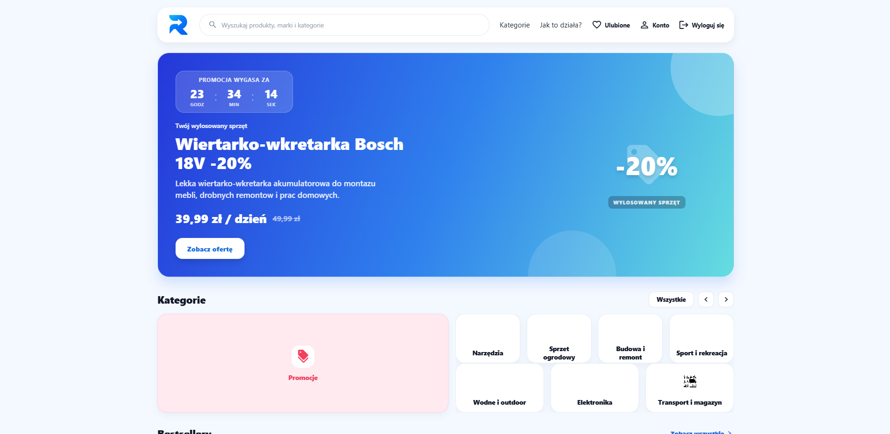

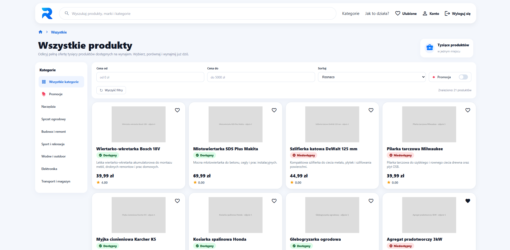

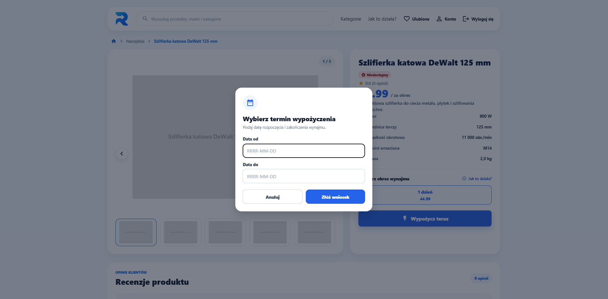

### Konto, wypożyczenia i recenzje

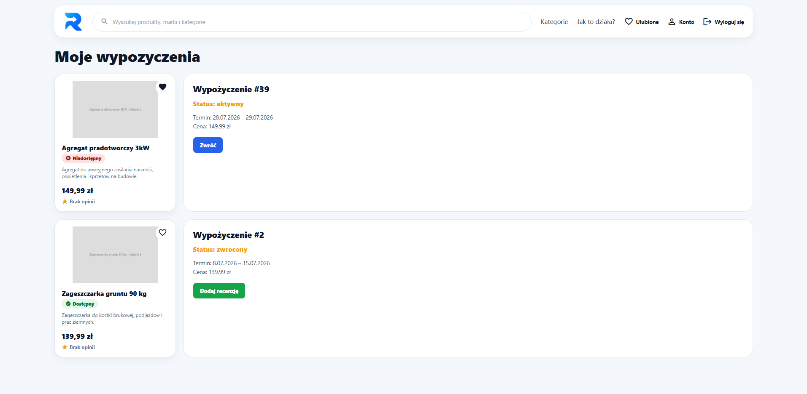

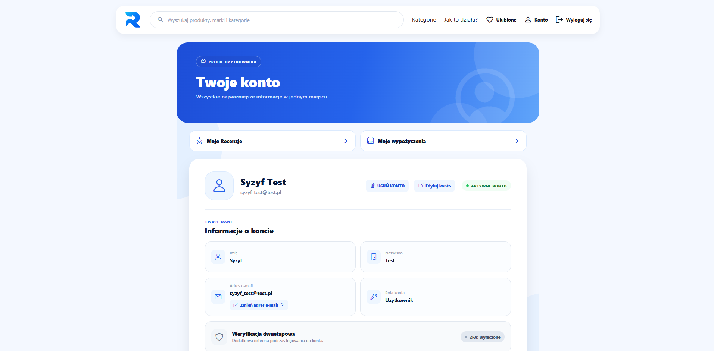

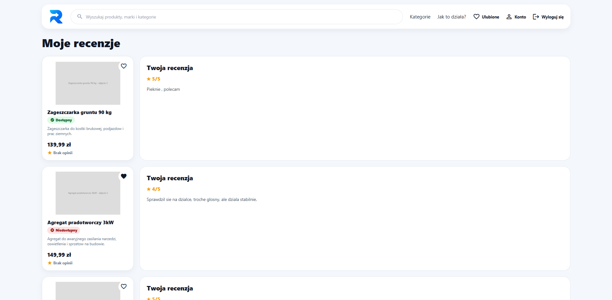

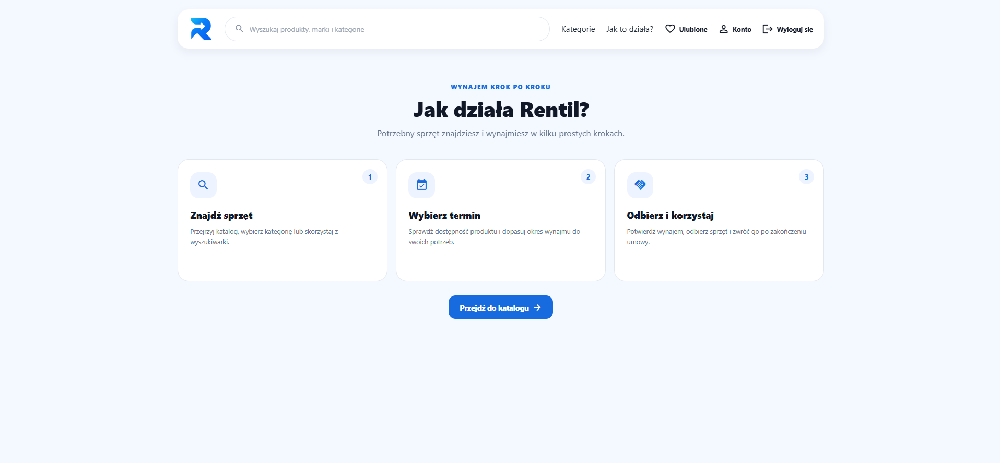

### Wyszukiwanie, ulubione i odzyskanie hasła

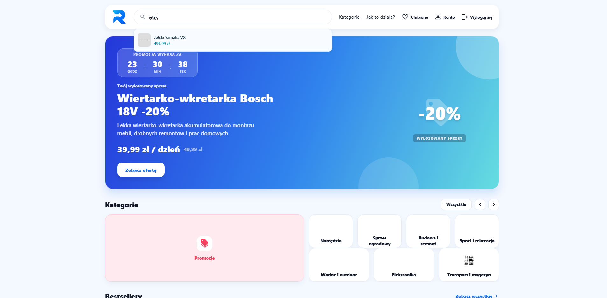

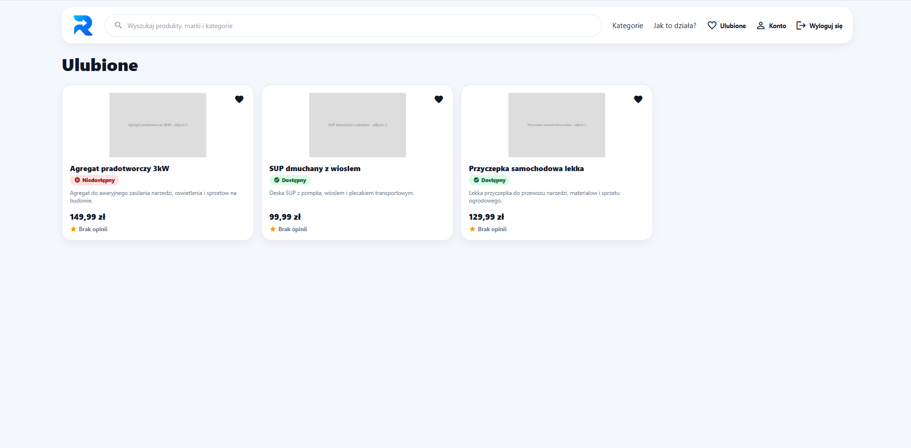

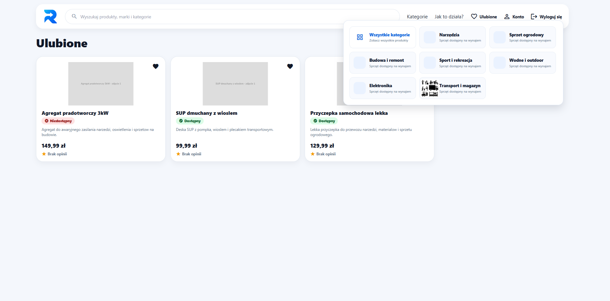

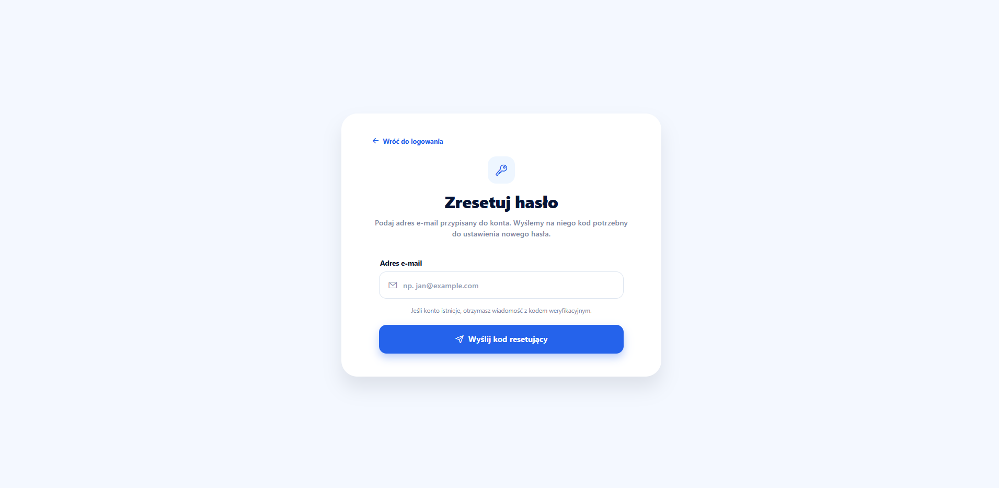

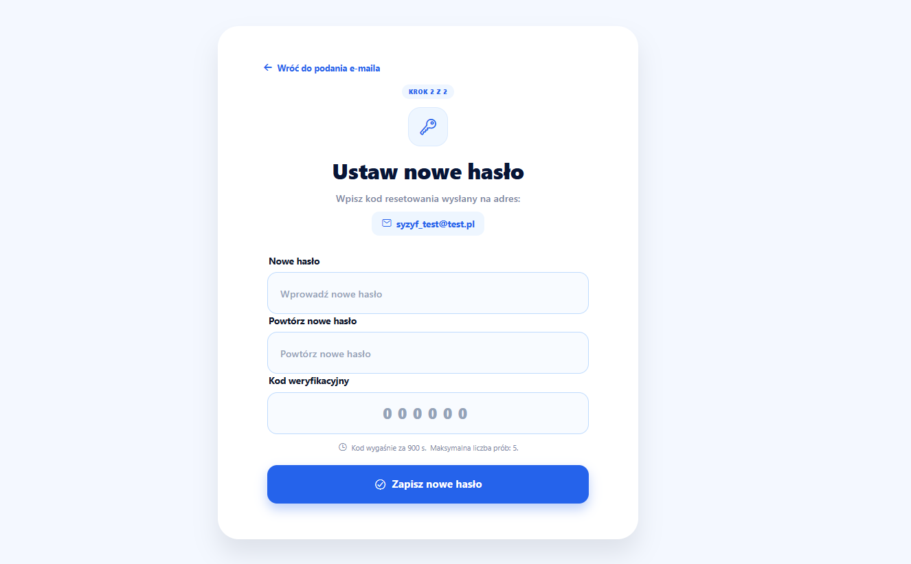

</details>

## 15. Postman — kolekcje i testowanie API

Repozytorium zawiera kompletny zestaw requestów Postmana dla backendu i workera. Są dostępne dwa formaty:

- pliki YAML w głównym katalogu `postman/`, rozbite na czytelne grupy i pojedyncze requesty;
- importowalne kolekcje i środowiska JSON w `backend/postman/` oraz `worker/postman/`.

### Struktura

```text
Wypo/
├── .postman/
│   └── resources.yaml                       # zasoby połączone z workspace Postmana
├── postman/
│   ├── collections/
│   │   ├── backend/                         # 81 requestów funkcjonalnych
│   │   ├── backend-tests/                   # 44 scenariusze testowe
│   │   └── worker/                          # 3 requesty API workera
│   ├── environments/
│   │   ├── Backend local.environment.yaml
│   │   └── Worker-local.environment.yaml
│   └── globals/workspace.globals.yaml
├── backend/postman/
│   ├── Wypo-API-Key-Bearer.postman_collection.json
│   └── Wypo-local.postman_environment.json
└── worker/postman/
    ├── Worker-API.postman_collection.json
    └── Worker-local.postman_environment.json
```

Plik `.postman/resources.yaml` wskazuje importowalne kolekcje backendu i workera oraz odpowiadające im środowiska. Dzięki temu repozytorium może być połączone z określonym workspace Postmana bez ręcznego odtwarzania listy zasobów.

### Zakres kolekcji backendu

| Grupa | Zawartość |
| --- | --- |
| Status API | Stan API, PostgreSQL i S3. |
| Autoryzacja | Login, rejestracja, 2FA, wylogowanie, reset hasła oraz obsługa kluczy API. |
| Konta | Tworzenie, dane własne i wskazanego konta, lista admina, zmiana e-maila, edycja `PATCH`/`PUT` i usuwanie. |
| Kategorie | Lista, szczegóły, dodawanie i edycja JSON/multipart, lista usuwalnych oraz usuwanie. |
| Sprzęt | Wyszukiwanie, lista, szczegóły, dodawanie, edycja, zdjęcia, lista usuwalnych i usuwanie. |
| Ulubione | Polubienie, odlubienie, własna lista oraz lista wskazanego użytkownika dla admina. |
| Wypożyczenia | Złożenie wniosku, listy, szczegóły, decyzja, aktywacja, zwrot, przypomnienia i ręczna edycja. |
| Recenzje | Dodanie, listy, szczegóły, ukrycie, odkrycie i logiczne usunięcie. |
| Worker | Odczyt i edycja ustawień oraz ręczne uruchomienie promocji. |
| Promocje | Utworzenie, lista, szczegóły, edycja, losowanie i reset promocji dziennej. |

Requesty są nazwane numerami, dlatego po otwarciu kolekcji tworzą kolejność odpowiadającą typowemu przepływowi testowania.

### Kolekcja `backend-tests`

Scenariusze testowe nie są kopią kolekcji funkcjonalnej. Sprawdzają najważniejsze kontrakty i błędy:

| Grupa testów | Przykłady |
| --- | --- |
| Publiczne | Status API, listy kategorii i sprzętu, wyszukiwarka oraz niepoprawne identyfikatory. |
| Walidacja danych | Brak danych logowania, słabe hasło, niepoprawne kody rejestracji/2FA/resetu. |
| Ochrona endpointów | Próby wykonania operacji konta, ulubionych, wypożyczeń, recenzji i paneli admina bez autoryzacji. |
| Kontrakty administratora | Kształt list kont, wypożyczeń, recenzji, zasobów usuwalnych i ustawień workera. |
| Walidacja administratora | Błędne statusy, oceny, ID zasobów i nieznane ustawienia workera. |
| Promocje | Lista admina, niepoprawna wartość procentowa i edycja nieistniejącej promocji. |

Testy należy wykonywać na bazie testowej. Część requestów celowo wysyła niepoprawne dane, a kolekcja funkcjonalna zawiera operacje tworzące, edytujące i usuwające rekordy.

### Środowisko `Backend local`

| Zmienna | Zastosowanie |
| --- | --- |
| `base_url` | Bazowy adres backendu, domyślnie `http://localhost:3000`. |
| `admin_email`, `admin_password` | Dane konta administratora używane przez requesty admina. |
| `user_email`, `user_password` | Dane zwykłego użytkownika i requesty wymagające sesji. |
| `new_user_email`, `new_user_password` | Dane rejestracji nowego konta testowego. |
| `new_email` | Docelowy adres procesu zmiany e-maila. |
| `verification_code` | Kod rejestracji, 2FA, resetu lub zmiany e-maila uzupełniany podczas testu. |
| `login_challenge`, `reset_challenge`, `email_change_challenge` | Tokeny procesów wieloetapowych zwracane przez API. |
| `api_key` | Klucz Bearer dla endpointów opartych na autoryzacji API. |
| `account_id`, `category_id`, `item_id` | Identyfikatory konta, kategorii i sprzętu używane w trasach dynamicznych. |
| `rental_id`, `promotion_id`, `review_id` | Identyfikatory wypożyczenia, promocji i recenzji. |
| `page` | Numer strony dla list paginowanych. |
| `image_path` | Lokalna ścieżka do pliku używanego w requestach multipart. |

Wartości `admin_password`, `user_password`, kodów i kluczy trzeba uzupełnić lokalnie. Prawdziwych haseł ani sekretów nie należy commitować.

### Środowisko workera

| Zmienna | Domyślna wartość | Znaczenie |
| --- | --- | --- |
| `worker_base_url` | `http://localhost:3001` | Bazowy adres API workera. |
| `worker_api_key` | wartość testowa | Klucz przesyłany jako `Authorization: Bearer ...`. |

Kolekcja workera obejmuje pobranie ustawień, próbę uruchomienia promocji bez autoryzacji oraz poprawnie autoryzowane uruchomienie.

### Uruchomienie requestów w Postmanie

1. Uruchom PostgreSQL, backend na porcie `3000` i — dla requestów workera — worker na porcie `3001`.
2. Zaimportuj kolekcje JSON z `backend/postman/` i `worker/postman/` wraz z odpowiadającymi środowiskami albo otwórz workspace połączony przez `.postman/resources.yaml`.
3. Wybierz środowisko **Backend local** lub **Worker local**.
4. Uzupełnij hasła, klucze, identyfikatory istniejących rekordów i `image_path`.
5. Wykonaj login przed endpointami sesyjnymi. Postman powinien zachować cookie `session_id` w swoim cookie jar.
6. Dla konta z 2FA skopiuj `challenge` z odpowiedzi loginu, wpisz kod e-mail i wywołaj potwierdzenie 2FA.
7. Requesty rejestracji, resetu hasła i zmiany e-maila również wymagają przepisania kodu oraz challenge z poprzedniego kroku.
8. Endpointy API key i workera wymagają nagłówka Bearer z kluczem zgodnym z konfiguracją uruchomionej usługi.

### Bezpieczne użycie

- korzystaj z osobnej bazy testowej;
- przed requestem `DELETE`, aktywacją lub zwrotem sprawdź używane ID;
- nie zapisuj prawdziwych haseł, kodów SMTP, kluczy S3 ani Bearer w plikach środowiska commitowanych do Git;
- po testach wyloguj sesję i usuń tymczasowe dane;
- przy błędzie najpierw sprawdź aktywne środowisko, `base_url`, cookie jar i body odpowiedzi.

## 16. Galeria administratora

<details open>
<summary><strong>Panel administratora</strong></summary>

### Zarządzanie ofertą

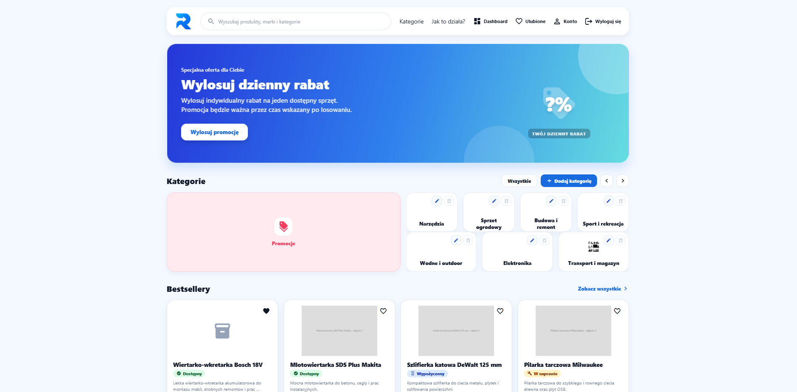

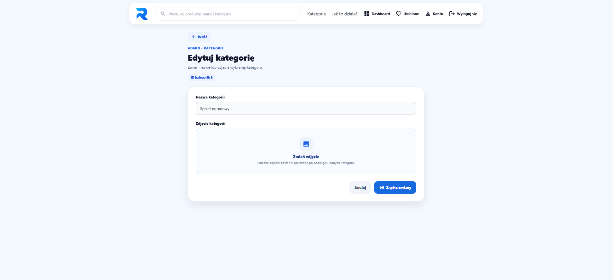

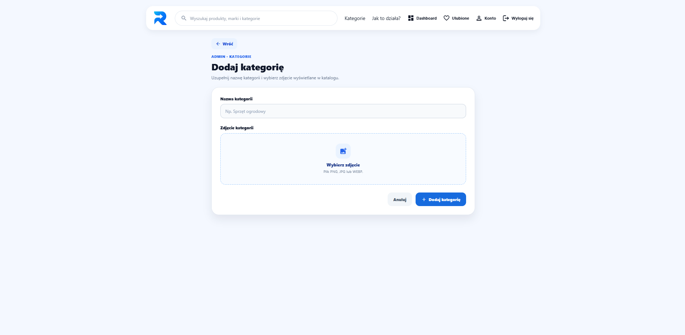

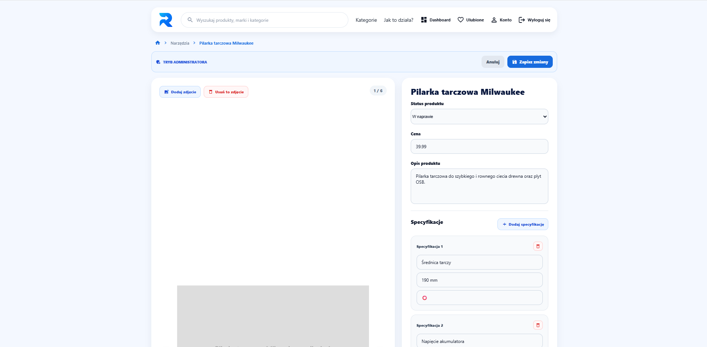

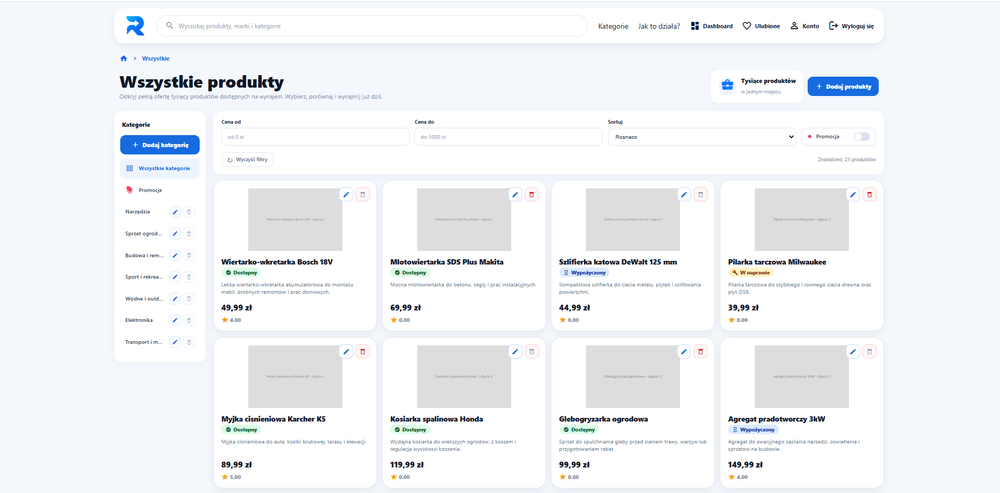

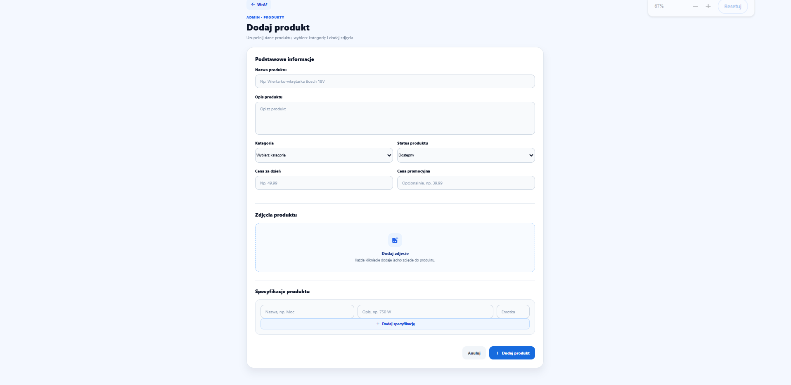

### Dashboard i wnioski

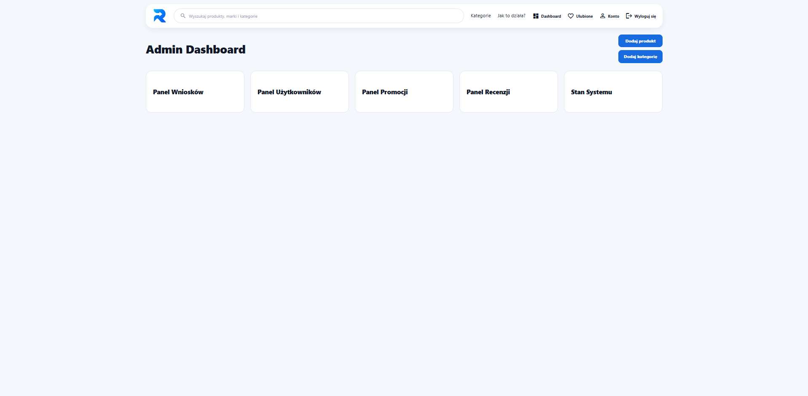

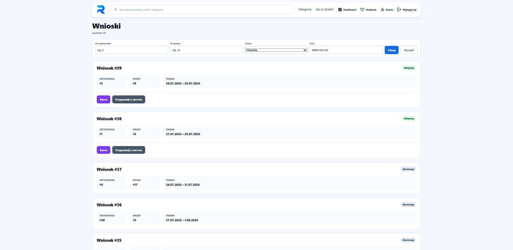

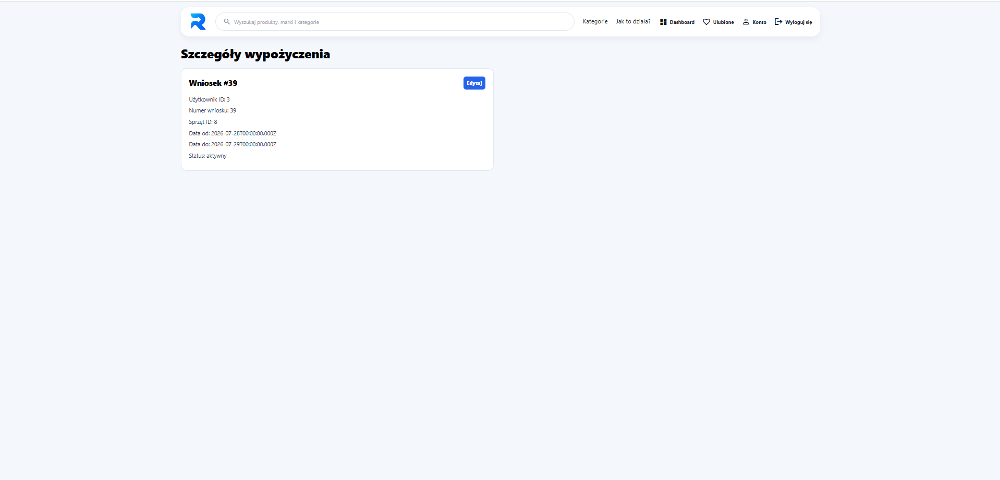

### Użytkownicy, promocje i recenzje

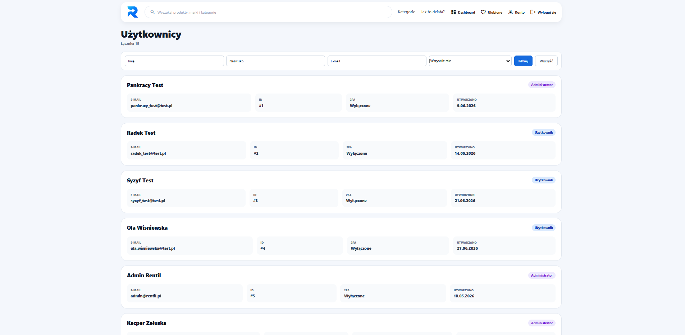

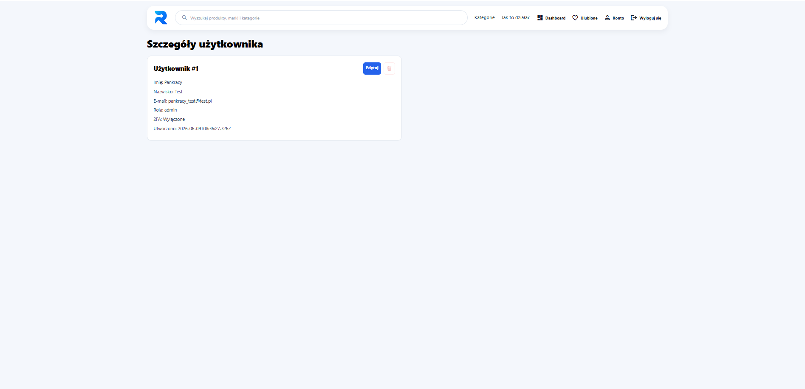

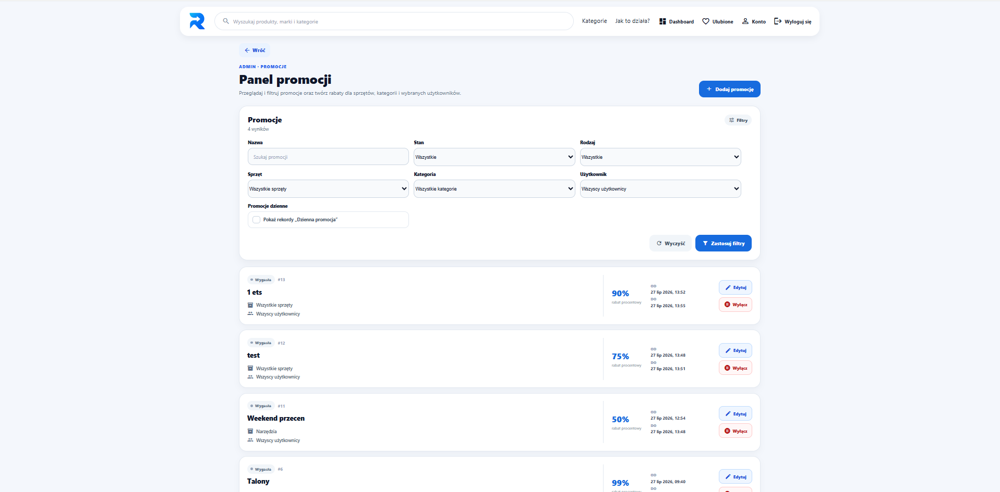

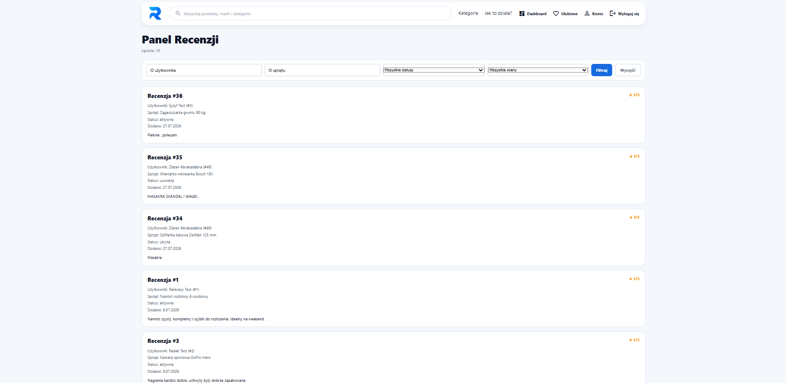

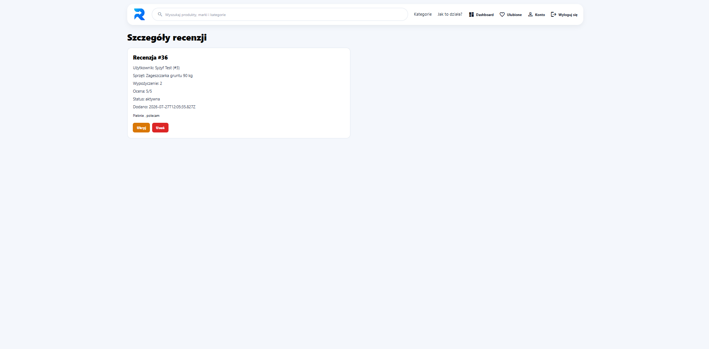

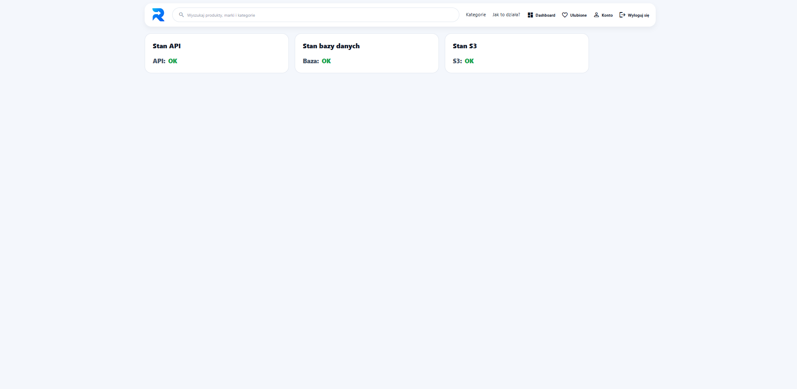

</details>
